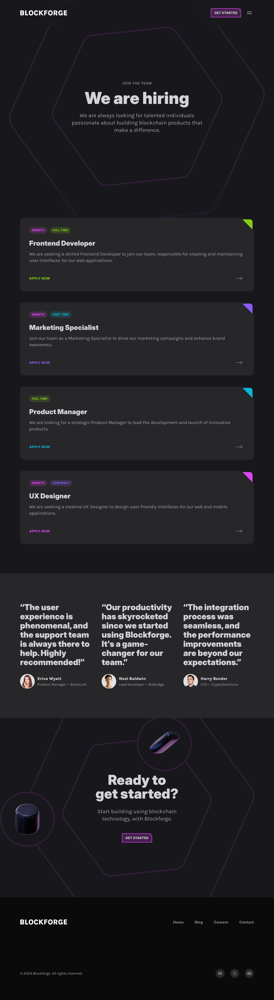

## Descripción del Proyecto

Blockforge es una plataforma innovadora que ofrece soluciones blockchain de vanguardia para empresas y desarrolladores. Este sitio web moderno y dinámico está construido con Astro y React, enfocado en presentar las capacidades y servicios de una plataforma blockchain. El diseño utiliza una paleta de colores oscuros con acentos en tonos de fuchsia, creando una estética futurista y tecnológica.



## Características Principales

- Diseño responsivo y moderno
- Secciones interactivas con animaciones suaves
- Blog integrado con artículos sobre blockchain y tecnología
- Sección de carreras para oportunidades de trabajo
- Integración de componentes React para funcionalidades dinámicas

## Tecnologías Utilizadas

- [Astro](https://astro.build/)
- [React](https://reactjs.org/)
- [Tailwind CSS](https://tailwindcss.com/)
- [TypeScript](https://www.typescriptlang.org/)

## Estructura del Proyecto

```
blockforge/
│
├── src/
│   ├── components/
│   ├── content/
│   │   ├── blog/
│   │   └── positions/
│   ├── layouts/
│   ├── pages/
│   ├── sections/
│   └── styles/
│
├── public/
│   └── assets/
│       └── images/
│
├── astro.config.mjs
├── tailwind.config.mjs
├── tsconfig.json
└── package.json
```

## Instalación y Uso

1. Clona el repositorio:
   ```
   git clone https://github.com/tu-usuario/blockforge.git
   ```

2. Instala las dependencias:
   ```
   cd blockforge
   npm install
   ```

3. Inicia el servidor de desarrollo:
   ```
   npm run dev
   ```

4. Abre tu navegador y visita `http://localhost:3000`

## Secciones Principales

### Hero

La sección Hero presenta una introducción impactante a Blockforge con animaciones y formas geométricas.

```tsx
export const HeroSection = () => {
  return (
    <section className="py-24 md:py-52 overflow-x-clip">
      <div className="container">
        <p className="uppercase font-extrabold text-center text-zinc-500 tracking-wider">
          Introducing Blockforge
        </p>
        <h1 className="font-heading font-black text-5xl md:text-6xl lg:text-7xl text-center mt-4 max-w-3xl mx-auto">
          The Future of Blockchain is Here.
        </h1>
        <p className="text-center text-xl md:text-2xl mt-6 text-zinc-400 max-w-xl mx-auto ">
          Blockforge is pioneering smart contract integrity with cutting-edge data solutions.
        </p>
        {/* ... (código adicional) ... */}
      </div>
    </section>
  );
}
```

### Características

La sección de características muestra las capacidades clave de Blockforge utilizando tarjetas interactivas.

```tsx
const FeaturesCardsSection = () => {
  return (
    <section className="py-24 overflow-clip md:-mt-28">
      <div className="container">
        <h2 className="font-heading font-black text-4xl md:text-5xl lg:text-6xl text-center">
          Discover the future of blockchain with Blockforge.
        </h2>
        <div className="mt-36 lg:mt-48 flex">
          {/* ... (código de las tarjetas de características) ... */}
        </div>
      </div>
    </section>
  );
};
```

### Blog

El blog presenta artículos sobre blockchain, criptomonedas y tecnología relacionada.

Ejemplo de un artículo del blog:

```markdown
---
title: "Blockchain Security: Protecting Digital Assets"
description: "Explore the key security features of blockchain technology and how it keeps digital assets safe from cyber threats."
pubDate: "2024-08-16"
category: Security
slug: "blockchain-security-protecting-digital-assets"
author:
  name: "John Smith"
  title: "Sr. Developer - BlockWorld"
  image: "/assets/images/john.jpg"
---

## Understanding the Basics of Blockchain Security

Lorem ipsum dolor sit amet, consectetur adipiscing elit. Sed do eiusmod tempor incididunt ut labore et dolore magna aliqua.

{/* ... (contenido del artículo) ... */}
```

## Contribución

Las contribuciones son bienvenidas. Por favor, abre un issue o realiza un pull request para sugerir cambios o mejoras.

## Licencia

Este proyecto está bajo la Licencia MIT. Consulta el archivo `LICENSE` para más detalles.

---

Esperamos que este README proporcione una visión general completa del proyecto Blockforge. Si tienes alguna pregunta o necesitas más información, no dudes en contactarnos.
